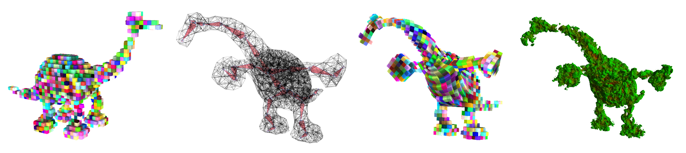

# Real-time rendering of animated meshless representations


This repository contains the source code for reproducing the results presented in the article "Real-time rendering of animated meshless representations" available at: https://hal.science/hal-05095359v1

Supplemental video available at : https://www.youtube.com/watch?v=6lKAvxV2mno


## Dependency
This project can be run a un Ubuntu 22, your GPU need to be mesh shader compatible. To compile, you need the following dependency:
+ C++20 compiler
+ CMake
+ Vulkan SDK (1.3.239 or newer)
+ GLFW3
+ GLM

To install apt depency you can run: `sudo apt install build-essential libvulkan-dev glslc libglfw3-dev libxinerama-dev libxcursor-dev libxi-dev libglm-dev`


## Compiling 

Pull all the submodules and compile with the following command
```
git submodule update --init --recursive
cmake -B build
cd build
make -j
```

## Testing

Then you can run the different examples from the paper:
+ 0_ArloSDF -> *Figure 10*
+ 1_AnimatedCage 
+ 2_AnimatedSDF 
+ 3_AnimatedVoxel -> *Figure 1*
+ 4_AnimatedFBM -> *Figure 9*
+ 5_AnimatedDynamicFBM -> *Figure 9*
+ 6_AnimatedDensityField -> *Figure 8*
+ 7_SelfIntersection -> *Figure 7*
+ 8_IntegrationWithTriangle -> *Figure 6*
+ 9_WiggleArlo -> *Figure 5*

## Citing

To cite our article :
```
@inproceedings{luton:hal-05095359,
  TITLE = {{Real-time rendering of animated meshless representations}},
  AUTHOR = {Luton, Pac{\^o}me and Tricard, Thibault},
  URL = {https://hal.science/hal-05095359},
  BOOKTITLE = {{HPG  2025 - Conference on High Performance Graphics}},
  ADDRESS = {Copenhague, Denmark},
  PAGES = {1-9},
  YEAR = {2025},
  MONTH = Jun,
  KEYWORDS = {Animation ; Rasterization},
  PDF = {https://hal.science/hal-05095359v1/file/Real_time_rendering_of_animated_meshless_representation_HPG25-3.pdf},
  HAL_ID = {hal-05095359},
  HAL_VERSION = {v1},
}
```